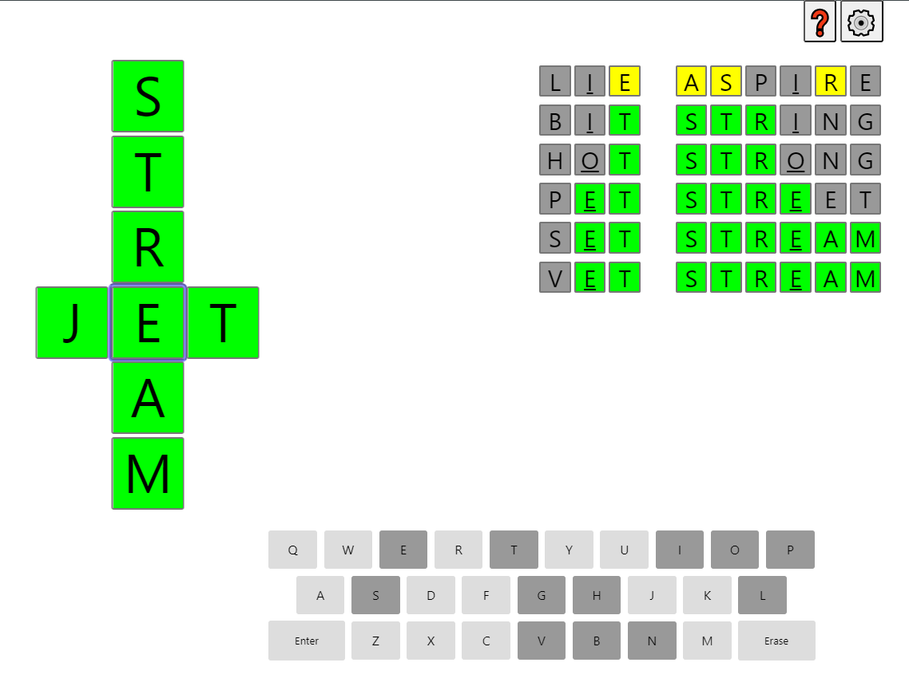

# Pygame project CrossWordle
___
## Описание проекта
Проект студента группы Б05-408 Сабельфельда Никиты Алексеевича  
Тема проекта: игра CrossWordle

Цель проекта - разработать графическое приложение - игру CrossWordle (вариация Wordle) на Python.  
Игра сочетает в себе элементы классического кроссворда и популярной игры Wordle.  

Цель пользователя - разгадать кроссворд.  
Игра должна предоставлять пользователю возможность вводить слова в клетки кроссворда,  
после чего давать подсказки о правильности ввода:

+ Зеленый символ: буква на правильном месте  
+ Желтый символ: буква есть в слове, но находится в неправильном месте  
+ Серый символ: буква отсутствует в слове  

Игра должна заканчиваться после 6 попыток, или если игрок разгадает кроссворд.

## Реализуемый функционал
1. Генерация случайного кроссворда: Игра должна составлять кроссворд из заранее подготовленного списка допустимых слов.  
2. Ввод пользователем: Игрок должен вводить слова с клавиатуры.
3. Проверка ввода: Игра должна проверять корректность ввода (существует ли такое слово, допустимые символы).
4. Предоставление подсказок: После каждой попытки игра должна отображать подсказки о правильности ввода, используя цветовые коды.
5. Подсчет попыток: Игра должна вести счет попыток, а также сообщать о выигрыше или проигрыше.
6. Завершение игры: Игра должна завершаться после 6 попыток или после разгадывания кроссворда.
7. Опционально: Возможность выбора сложности (количество попыток, число слов в кроссворде).

## Архитектура

Уровень представления (**Presentation Layer**):  
+ Отвечает за отображение игрового поля и элементов управления.  
+ Использует библиотеку Pygame для создания графики и обработки событий от пользователя.  
+ Включает в себя классы для отображения игрового поля, букв, сетки и других элементов интерфейса.

Логический уровень (**Logic Layer**):  
+ Реализует логику игры, включая проверку правильности слов, подсчёт попыток и управление игровым процессом.  
+ Не зависит от конкретных деталей реализации графического интерфейса.  
+ Может быть протестирован отдельно от уровня представления.  
+ Содержит классы для работы с игровыми данными: слова, попытки, угаданные буквы, уровни сложности.  

Уровень доступа к данным (**Data Access Layer**):  
+ Обеспечивает доступ к внешним источникам данных (базе данных слов).  
+ Позволяет легко изменять источники данных без изменения логики игры.  
+ В данном случае будет реализован в виде простого файла со словами, который загружается при запуске игры.  

Взаимодействие между слоями:
1) Уровень представления получает события от пользователя и передаёт их логическому уровню.  
2) Логический уровень обрабатывает события и вызывает соответствующие методы уровня представления для обновления экрана.  
3) Слой доступа к данным предоставляет данные логическому уровню по запросу.  

Диаграмма архитектуры приложения:

### Поддерживаемые версии Python  
Python 3.6 и выше

### Основные классы:
1. Класс **Game**:
    + Атрибуты:  
    screen: Экран игры.  
    grid: Двумерный массив (сетка) для хранения букв кроссворда.  
    crosswordle: Экземпляр класса CrossWordle  
    attempts: Количество сделанных попыток (целое число).  
    max_attempts: Максимальное количество попыток (целое число).  
    selected_cell: Текущая выбранная ячейка.  
    state: Состояние игры (начало, игра, конец).

    + Методы:  
    __init__(self, max_attempts): Инициализатор  
    generate_grid(self): Создает сетку кроссворда из слов.  
    is_game_over(self): Проверяет, завершена ли игра (все слова угаданы или исчерпаны попытки).  
    handle_event(self, event): Обрабатывает события Pygame.  
    update(self): update(self): Обновляет состояние игры и игровой логики.  
    run(self): Основной цикл игры.

3. Класс **CrossWordle**:
    + Атрибуты:  
    hidden_words: Список слов кроссворда (Список экземпляров класса HiddenWord)  
    users_words: Список введённых пользователем слов (Список экземпляров класса UsersWord)   

    + Методы:  
    \_\_init__(self, hidden_words, max_attempts)  
    overlap_words(self, users_word, hidden_word): "Наложить" слово введенное пользователем поверх загаданного  
    и окрасить соттветсвующие клетки в нужные цвета  

4. Класс **UsersWord**:
    + Атрибуты:  
    cells: Список ячеек, которые занимает слово (Список экземпляров класса Cell) 
    
    + Методы:  
    is_filled(self): Проверяет, что нет пустых клеток  
    is_correct(self): Проверяет слово на корректность (т.е. что это не бессмысленный набор букв)  

5. Класс **HiddenWord**:
    + Атрибуты:  
    length: Длина слова  
    text: Само слово  
    cells: Список ячеек, которые занимает слово (Список экземпляров класса Cell) 

    + Методы:  
    \_\_init__(self, length, text, cells)  
    is_guessed(self): Проверяет, угадано ли слово  
    get_text(self): Возвращает слово  

6. Класс **Cell**:
    + Атрибуты:  
    row: Индекс строки  
    column: Индекс столбца  
    letter: Буква в ячейке (строка).  
    color: Цвет ячейки (зеленый, желтый, серый).
    
    + Методы:  
    \_\_init__(self, row, col, letter)  
    change_color_to_green(self): Меняет цвет клетки на зеленый  
    change_color_to_yellow(self): Меняет цвет клетки на жёлтый  
    get_color(self): Возвращает цвет клетки  
    is_empty(self): Проверяет клетку на отсутствие буквы  

### Библиотеки:
Pygame: Основная библиотека для графики и взаимодействия с пользователем.  
Pygame GUI: Модуль для создания кнопок, лейблов, индикаторов выполнения.  
Random: Модуль для генерации кроссворда.

### Схема работы:
1. Загрузка списка случайных слов из файла.
2. Создание объекта Game с настройками.
3. Генерация сетки кроссворда.
4. Основной цикл Pygame:  
    Обработка событий (ввод с клавиатуры, нажатия мыши).  
    Обновление состояния игры.  
    Отрисовка элементов игры на экране.  